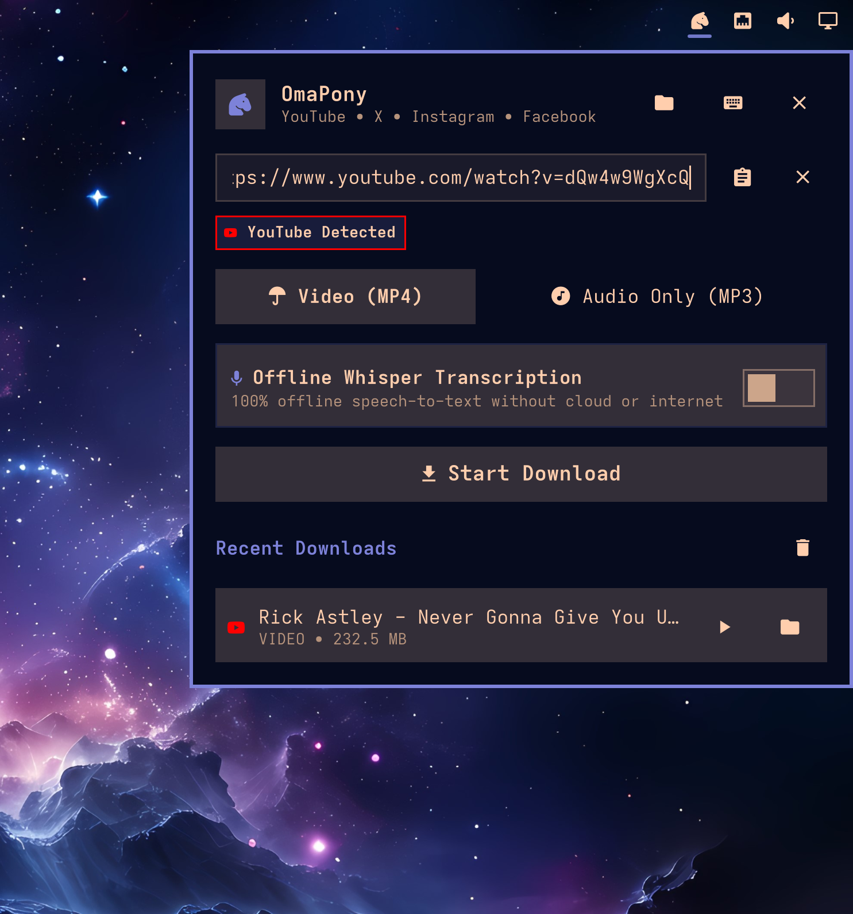

# 🐴 OmaPony

> **The high-octane media downloader & offline Whisper AI transcriber for Omarchy Linux.**

A sleek, lightweight, and modern status bar widget and background download daemon for [Omarchy Linux](https://omarchy.org/) running Hyprland and Quickshell.

Featuring automatic platform link detection, high-bitrate video/audio extraction, synchronized subtitle generation, and 100% offline speech recognition powered by local Whisper AI.

<p align="center">
  
</p>

---

## ✨ Features

- **🐴 Sleek Horse Head Bar Widget**: Sits cleanly on the top-right status bar with perfect optical alignment and theme integration. Smoothly transitions into an animated spinner with active colors and progress tooltips during live downloads.
- **⚡ Superkey Instant Link Capture**: Highlight or copy any video/audio URL anywhere on your screen and hit `SUPER + ALT + V` to grab and enqueue the download instantly in the background with desktop notifications.
- **🎙️ 100% Offline Whisper AI Transcription**:
  - Local speech-to-text running directly on your hardware via `whisper.cpp` (`whisper-cli`).
  - Zero cloud reliance, zero subscriptions, zero API keys, and 100% private.
  - Generates synchronized SubRip (`.srt`) and WebVTT (`.vtt`) subtitles (automatically recognized by MPV, VLC, and other players) along with full plaintext transcripts (`.txt`).
  - Model selection: `tiny` (fastest), `base` (recommended default), and `small`.
- **🎯 Multi-Platform Auto-Detection**: Real-time link inspection with platform-colored badges and icons:
  - **YouTube** (`YouTube` — Red accent)
  - **X / Twitter** (`X / Twitter` — Blue accent)
  - **Instagram** (`Instagram` — Magenta accent)
  - **Facebook** (`Facebook` — Blue accent)
  - **TikTok** (`TikTok` — Cyan accent)
  - **Reddit** (`Reddit` — Orange accent)
  - **Web Video** (`Generic Stream` — Theme accent)
- **🎵 Video & Audio Extraction Modes**:
  - **Video (MP4)**: Merges the highest quality video and audio streams seamlessly via `yt-dlp` and `ffmpeg`.
  - **Audio Only (MP3)**: Extracts clean, high-fidelity 320kbps MP3 audio.
- **📋 Themed Quickshell Modal**:
  - One-click clipboard link insertion.
  - Live progress bar, download speed, and ETA tracking.
  - Active downloads list with cancel controls.
  - History list with one-click media play and show-in-folder actions.
- **💻 CLI & Shell IPC**: Complete terminal and script control via `omapony` CLI and `omarchy-shell omapony <action>`.

Powered by your favorite Discord troll Tonythepony ⚡️⚡️ ft. 🍻 Beers Superpowers 💨🔥

---

## 📥 Installation

### One-Command Install (Omarchy Plugin Manager)

```bash
omarchy plugin add https://github.com/tonythesuperpony/omapony.git --enable
ln -sf ~/.config/omarchy/plugins/omapony/bin/omapony ~/.local/bin/omapony
```

### Manual Installation

Clone directly into your Omarchy shell plugins directory:

```bash
git clone https://github.com/tonythesuperpony/omapony.git ~/.config/omarchy/plugins/omapony
ln -sf ~/.config/omarchy/plugins/omapony/bin/omapony ~/.local/bin/omapony
omarchy plugin enable omapony --section right
```

---

## ⌨️ Superkey Shortcuts

Add to your `~/.config/hypr/bindings.lua`:

```lua
-- OmaPony Media Downloader:
o.bind("SUPER + ALT + V", "Download selected video/audio (OmaPony)", "omapony grab")
o.bind("SUPER + SHIFT + V", "Toggle OmaPony downloader", "omarchy-shell omapony toggle")
```

| Keybinding | Action | Command |
|---|---|---|
| `SUPER + ALT + V` | Grab highlighted link & start download | `omapony grab` |
| `SUPER + SHIFT + V` | Toggle OmaPony popup panel | `omarchy-shell omapony toggle` |

---

## 🖱️ Status Bar Mouse Actions

| Mouse Button | Action |
|---|---|
| **Left-click** | Open / toggle OmaPony popup panel |
| **Right-click** | Instant grab & download from current selection or clipboard |
| **Middle-click** | Open destination download directory in your file manager |

---

## 🧠 Offline Whisper Setup

OmaPony uses `whisper.cpp` for lightning-fast, offline speech-to-text.

To install the offline engine:

```bash
omarchy pkg add whisper-cpp
```

OmaPony automatically manages GGML models in `~/.local/share/omarchy/omapony/models/`.

---

## 💻 CLI Usage

```bash
# Grab selected text or clipboard and download in background
omapony grab

# Grab as MP3 audio with offline Whisper transcription & subtitles
omapony grab --format audio --transcribe --subtitles

# Manually queue a URL
omapony add "https://www.youtube.com/watch?v=..." --format video

# Toggle the status bar popup panel
omapony toggle

# Check active queue and history status in JSON
omapony status

# Clear download history
omapony clear-history
```

---

## 🗑️ Uninstallation

To cleanly and completely remove OmaPony from your system:

### 1. Remove the Plugin

Using the Omarchy plugin manager:

```bash
omarchy plugin remove omapony --yes
```

Or manually:

```bash
omarchy plugin disable omapony
rm -rf ~/.config/omarchy/plugins/omapony
omarchy-shell shell rescanPlugins
```

### 2. Remove the CLI Symlink

Remove the command binary symlink from your user PATH:

```bash
rm -f ~/.local/bin/omapony
```

### 3. Remove Keybindings

Remove or comment out the OmaPony keybindings in `~/.config/hypr/bindings.lua`:

```lua
-- Remove or comment out these lines:
-- o.bind("SUPER + ALT + V", "Download selected video/audio (OmaPony)", "omapony grab")
-- o.bind("SUPER + SHIFT + V", "Toggle OmaPony downloader", "omarchy-shell omapony toggle")
```

Then reload your Hyprland configuration (or restart your session).

### 4. Remove Configuration & Cached Models (Optional)

To delete user preferences, download history, and cached Whisper AI GGML models:

```bash
rm -rf ~/.config/omarchy/omapony ~/.local/share/omarchy/omapony
```

> **Note**: Your downloaded video and audio files in `~/Videos/OmaPony` and `~/Music/OmaPony` will remain untouched.

### 5. Remove Whisper Dependencies (Optional)

If you installed `whisper-cpp` solely for OmaPony and no longer need it:

```bash
omarchy pkg remove whisper-cpp
```

---

### ⚡ Quick Complete Uninstall (One-Liner)

To remove the plugin, CLI binary, configuration, and cached models in one shot:

```bash
omarchy plugin remove omapony --yes && rm -f ~/.local/bin/omapony && rm -rf ~/.config/omarchy/omapony ~/.local/share/omarchy/omapony
```
*(Remember to also remove the keybindings from `~/.config/hypr/bindings.lua`)*

---

## 📄 License

MIT © [tonythesuperpony](https://github.com/tonythesuperpony)
